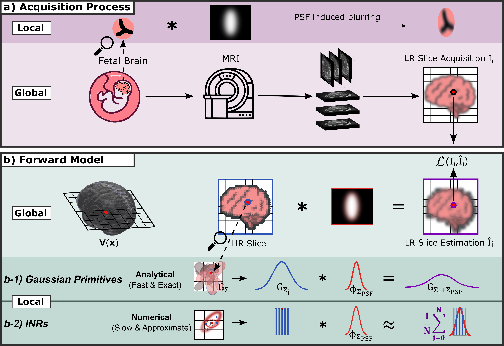

# GSVR — Gaussian Slice-to-Volume Reconstruction

Reconstruct a high-resolution 3D MRI volume from multiple stacks of thick 2D slices using 3D anisotropic Gaussian primitives. The primary application is **fetal brain T2w MRI**, but the method is general to any multi-stack SVR setting.

> Fetal brain MRI is acquired as a small number of orthogonal stacks of thick 2D slices, corrupted by inter-slice fetal motion. Reconstructing a single isotropic high-resolution volume from these stacks is the *slice-to-volume reconstruction* (SVR) problem. GSVR poses SVR as joint optimisation of a sparse set of anisotropic 3D Gaussian primitives together with per-slice rigid motion-correction parameters. The forward model analytically convolves each Gaussian with the slice point-spread function, so PSF handling is exact (not learned). Training runs end-to-end with AdamW in tens of seconds on a single consumer GPU.

📄 Paper: *Fast and Explicit: Slice-to-Volume Reconstruction via 3D Gaussian Primitives with Analytic Point Spread Function Modeling*, MIDL 2026 ([OpenReview](https://openreview.net/forum?id=W9eWUriVG9)).

---

## Live Reconstruction

<p align="center">
  
</p>

---

## Method

<p align="center">
  
</p>

**Figure: Acquisition process and analytic forward model.**
**(a) Acquisition.** Clinical fetal MRI produces thick 2D slices whose through-plane resolution is degraded by the anisotropic point spread function (PSF) of the MRI scanner. **(b) Forward model.** GSVR parameterises the unknown high-resolution (HR) volume as a field of anisotropic 3D Gaussian primitives G<sub>Σ<sub>j</sub></sub>. By modelling the PSF as a Gaussian kernel φ<sub>Σ<sub>PSF</sub></sub>, the observed low-resolution slice intensity is simulated analytically via **exact covariance addition** (Σ<sub>obs</sub> = Σ<sub>j</sub> + Σ<sub>PSF</sub>) **(b-1)**, replacing the expensive Monte Carlo sampling required by implicit neural representations (INRs) **(b-2)** with a single deterministic matrix addition. This closed-form PSF convolution is the key property that unlocks real-time convergence speeds.

**Key features:**
- PSF-aware forward model (analytically convolves Gaussian primitives with each stack's slice PSF)
- Per-slice rigid motion correction learned end-to-end
- Independently toggleable per-slice intensity scaling and residual-based Welsch outlier down-weighting
- Graph-TV smoothness on per-Gaussian colour (suppresses between-Gaussian intensity striping)
- One-sided scale lower-bound regulariser — allows heterogeneous Gaussian sizes
- FAISS GPU k-NN for fast nearest-Gaussian lookups

---

## Repository Layout

```
GaussianSplatting/
├── GS_SVR/
│   ├── configs/
│   │   ├── config_subjects_simulated.yaml   # Simulated data
│   │   └── config_subjects_real.yaml        # Real fetal brain data
│   ├── train.py            # Entry point — load data, train, save reconstruction
│   ├── gsvr.py             # GaussianSVR model: primitives + motion correction
│   ├── utils.py            # Data loading, PSF, loss, visualisation
│   └── environment.yml     # Conda environment spec
└── output/                 # Default output directory
```

---

## Installation

### 1. Clone the repository

```bash
git clone <repo-url>
cd GaussianSplatting
```

### 2. Create the Conda environment

```bash
conda env create -f GS_SVR/environment.yml
conda activate gsplat
```

This installs Python 3.12, PyTorch 2.7.0 (CUDA 12.8), FAISS-GPU 1.12.0, ANTsPy 0.4.2, and all other dependencies.

> **Requirements:** CUDA 12.8, cuDNN 9.x, driver ≥ 570.

> **FAISS-GPU install troubles?** This is the most brittle dependency. If conda can't resolve `faiss-gpu=1.12.0` from the `pytorch` channel for your CUDA / driver combination, try (a) installing with `mamba env create -f environment.yml`, (b) swapping to `conda-forge::faiss-gpu` at a matching version, or (c) falling back to `faiss-cpu` — training still works but the per-50-epoch k-NN rebuild is slower.

---

## Quick Start

### Simulated data

Edit the paths in [GS_SVR/configs/config_subjects_simulated.yaml](GS_SVR/configs/config_subjects_simulated.yaml) to point to your data, then run:

```bash
cd GS_SVR
python train.py --config configs/config_subjects_simulated.yaml
```

Training typically runs for 500 epochs (roughly 20–100 seconds depending on dataset size and GPU). The final reconstruction is saved as a NIfTI file under `output/`.

### Real data

```bash
cd GS_SVR
python train.py --config configs/config_subjects_real.yaml
```

### Sanity check — overfit to HR volume directly

Both config files contain a commented-out block at the bottom that sets a single high-resolution stack as input with `slice_thickness: [res_z]`. Uncomment it to quickly verify the model can perfectly reconstruct a known volume before running on real data. Make sure to turn-off motion correction for this single stack scenario!

---

## Input Data Format

GSVR supports two mutually exclusive input modes, dispatched automatically by [GS_SVR/data_inputs.py](data_inputs.py) from the config:

### (a) Stacks mode — multi-slice NIfTI volumes

| Field | Format | Notes |
|-------|--------|-------|
| `subject.input_stacks` | `.nii.gz` (3D volume) | Typically 3–6 stacks; orthogonal orientations recommended |
| `subject.input_masks`  | `.nii.gz` (binary mask) | One per stack; leave as `[]` to use non-zero voxels |

Each stack's third axis is the slice axis; the per-slice rigid motion correction operates along it.

### (b) Slices mode — directory of motion-corrected single-slice files

| Field | Format | Notes |
|-------|--------|-------|
| `subject.slices_dir`   | directory | One single-slice per `.nii.gz` file; each carries its own (already motion-corrected) affine |
| `subject.slice_glob`   | glob | Default `[0-9]*.nii.gz` — matches [SVoRT](https://github.com/daviddmc/SVoRT)-style numeric filenames |
| `subject.mask_prefix`  | string | Default `mask_` — for each slice `<N>.nii.gz`, the loader looks for `<mask_prefix><N>.nii.gz` alongside it |

Use this mode to consume the per-slice output of tools like SVoRT. Per-slice motion correction in GSVR remains active and refines on top of the external alignment. See [GS_SVR/configs/config_subjects_svort_slices.yaml](configs/config_subjects_svort_slices.yaml) for example.

All files must share a common world coordinate system (same or compatible affines). For reconstructions that fail due to heavily motion corrupted or misaligned stacks, pre-register the stacks (and slices) externally (e.g., via [SVoRT](https://github.com/daviddmc/SVoRT)) so they are roughly aligned before GSVR refines the per-slice motions.

**Output:** a single `.nii.gz` reconstruction at the spacing specified by `data.reconstruction.spacing`.

---

## Configuration Reference

All parameters live in a single YAML file passed via `--config`.

### `experiment`

| Parameter | Default | Description |
|-----------|---------|-------------|
| `name` | `"gsvr_initial_run"` | Sub-directory name under `output_root` |
| `output_root` | `"output/"` | Root directory for all outputs |
| `seed` | `42` | Global random seed |

---

### `gsvr` — Model & Training

| Parameter | Default | Description |
|-----------|---------|-------------|
| `motion_correction` | `True` | Learn per-slice rigid correction (rotation + translation). Disable only if stacks are already perfectly aligned. |
| `slice_scaling` | `True` / `False` | Learnable per-slice intensity scale (B1 field, excitation profile). Enabled for real data; disabled for simulated data. |
| `slice_weighting` | `True` / `False` | Residual-based per-slice Welsch outlier down-weighting (non-learnable, recomputed from residuals). Enabled for real data; disabled for simulated data. |
| `psf` | `True` | Analytically convolve Gaussian covariances with the slice PSF. Should almost always be `True`. |
| `max_epochs` | `500` | Total training epochs. |
| `lambda_mc_rot` | `0.01` | Quaternion-imaginary-part penalty for the motion-correction rotation. |
| `lambda_mc_trans` | `2e-4` | L2 penalty on per-slice translations (mm²). |
| `lr_eta_min_factor` | `0.1` / `0.05` | Cosine-annealing floor as a fraction of the initial LR. Real data: `0.1`; simulated data: `0.05`. |
| `mini_batch_size` | `500000` | Voxels per mini-batch. `null` = full-batch (fastest if VRAM allows). Set lower if you hit OOM errors. |

#### `gsvr.g_primitives` — Gaussian Field

| Parameter | Default | Description |
|-----------|---------|-------------|
| `num_gaussians` | `30000` | Number of 3D Gaussian primitives. Increase for finer detail; decrease to save memory. |
| `init_type` | `"content_adaptive"` | Seed positions by gradient-magnitude-weighted sampling (concentrates primitives near tissue boundaries). |
| `init_lambda` | `0.0` | Blend between content-adaptive (`0.0`) and uniform (`1.0`) initialisation. |
| `scale_init` | `0.5` | Initial log-std for all Gaussians (log-std=0.5 → std ≈ 1.65 mm). Match roughly to expected structure scale. |
| `scale_target` | `0.05` | One-sided **lower bound** on Gaussian log-scale. Only collapses below this value are penalised; larger Gaussians are unconstrained (so they can carry low-frequency homogeneous regions). |
| `lambda_reg` | `0.05` | Weight of the scale lower-bound penalty. |
| `K_neighbors` | `32 - 64` | Number of nearest Gaussians evaluated per query point. Higher = smoother field, slower k-NN. |
| `topK_every` | `50` | Recompute the FAISS k-NN index every N epochs. Lower = more accurate but slower training. |
| `K_color` | `8` | Neighbours for graph-TV on colour (Gaussian-to-Gaussian K-NN, rebuilt at the `topK_every` cadence). |
| `lambda_color_tv` | `0.0` | Graph-TV weight: penalises L1 colour differences between each Gaussian and its `K_color` spatial neighbours. Smooths the colour field to suppress between-Gaussian intensity striping. `0` = disabled. Try `0.001`–`0.1` if needed. |

#### `gsvr.coarse_to_fine` — Progressive Activation (optional)

| Parameter | Default | Description |
|-----------|---------|-------------|
| `enabled` | `False` | Activate Gaussians in stages instead of all at once. |
| `growth_schedule` | list | `[epoch, num_active]` pairs; last must equal `num_gaussians`. |
| `scale_target_alpha` | `0.5` | Inflates the scale floor during low-active phases so early Gaussians are naturally large. |

#### `gsvr.learning_rates`

| Parameter | Default | Description |
|-----------|---------|-------------|
| `g_primitives_mu` | `2.5e-2` | Gaussian mean positions |
| `g_primitives_scale` | `2.5e-2` | Log-scale parameters |
| `g_primitives_rot` | `2.5e-2` | Rotation quaternions |
| `g_primitives_color` | `2.5e-2` | Scalar intensity values |
| `gsvr_mc_rot` | `2.5e-3` | Per-slice motion correction rotation (kept low — corrections are expected to be small) |
| `gsvr_mc_trans` | `5.0e-2` | Per-slice motion correction translation |
| `gsvr_slice_scale` | `1.0e-3` | Per-slice intensity scale (only active when `slice_scaling: True`) |

---

### `data` — Input Data

#### `data.preprocessing`

| Parameter | Default | Description |
|-----------|---------|-------------|
| `bias_field_correction` | `False` | ANTs N4 bias field correction. Slow; rarely needed for simulated data or pre-corrected stacks. |
| `denoise` | `False` | ANTs denoising. Slow; use only if stacks have high thermal noise. |

> **Brain mask handling.** Training supervision is restricted to in-mask voxels, and the rendered reconstruction is multiplied by a motion-corrected brain mask at output time. Disable with `data.reconstruction.apply_mask: False`; tune `mask_dilation_voxels` / `mask_closing_voxels` / `mask_vote_threshold` under `data.reconstruction:` if you see boundary artefacts.

#### `data.reconstruction`

| Parameter | Default | Description |
|-----------|---------|-------------|
| `spacing` | `[0.5, 0.5, 0.5]` | Isotropic output voxel spacing in mm. Finer spacing yields a larger output volume and longer rendering time. |
| `apply_mask` | `True` | Multiply the rendered volume by the motion-corrected brain mask. Set `False` to inspect the raw Gaussian field outside the brain (debug / ablation). |

#### `data.subject`

| Parameter | Description |
|-----------|-------------|
| `name` | Identifier used for output filenames |
| `slice_thickness` | Slice thickness in mm per stack (scalar or list). Determines through-plane PSF sigma. |
| `input_stacks` | List of paths to input `.nii.gz` stack volumes |
| `input_masks` | List of paths to binary mask `.nii.gz` files (one per stack). Leave as `[]` for no mask. |

---

### `visualization.snapshots` — Intermediate Reconstructions

| Parameter | Default | Description |
|-----------|---------|-------------|
| `enabled` | `false` | When `true`, save intermediate reconstructions during training. |
| `interval_seconds` | `0.25` | Wall-clock seconds between snapshots. |
| `subdir` | `"snapshots"` | Snapshots are written under `<output_root>/<experiment.name>/<subject.name>/<subdir>/`. |

---

## Possible Pitfalls

**Out-of-memory errors**
Set `mini_batch_size: 500000` (or lower) to process voxels in chunks.

**Blurry reconstruction**
- Ensure `psf: True` and that `slice_thickness` accurately reflects your acquisition. An incorrect PSF causes systematic blurring or ringing.
- Try smaller weights for `lambda_color_tv` and `lambda_reg`and/or a smaller `scale_target`. 
- Check that `K_neighbors` is large enough (30–50 is typical).
- Train for more epochs 

**Between-slice intensity striping**
- Set `lambda_color_tv` to a moderate value (e.g. `0.01`–`0.1`) to enforce smoothness across neighbouring Gaussian colours.
- Increase `scale_target`. If not enough, increase `lambda_reg`.
- Try a larger value for `scale_init`.

**Motion correction diverges or produces artefacts**
- The motion correction LR (`gsvr_mc_rot: 2.5e-3`) is intentionally low. If stacks have large motion (>5 mm), pre-register them externally first.

**Training is very slow**
- Ensure the model is running on GPU.
- If you run a new configuration (e.g. number of Gaussians) for the first time, the kernel compilation needs to be re-done. This takes some time for the first iteration. 
- If you use FAISS-CPU, this will be the most significant bottleneck. Try setting `topK_every: 100` to reduce FAISS index rebuild frequency.

**Gaussian primitives collapse**
- Increase `lambda_reg` (e.g. to `0.1`) to enforce the scale lower bound more aggressively.
- Check that `scale_init` is consistent and appropriate for your voxel spacing.

**Boundary holes or jagged edges in the reconstruction**
Raise `mask_closing_voxels` (default 5) under `data.reconstruction:` to bridge wider gaps without inflating the boundary. Raise `mask_dilation_voxels` only if you also want extra outward growth.

---

## Output Files

All outputs are written to `{output_root}/{experiment.name}/{subject.name}/`:

| File | Description |
|------|-------------|
| `reconstruction_ttime=*s.nii.gz` | Final 3D volume at `data.reconstruction.spacing` (filename includes training time) |
| `snapshots/` | Intermediate reconstructions (only when `visualization.snapshots.enabled: true`) |
| Training logs | Per-epoch loss components printed to stdout |

---

## Implementation Details

GSVR represents the unknown HR volume as a set of **K anisotropic 3D Gaussian primitives**, each parameterised by a mean position, log-scale, rotation quaternion, and scalar intensity. Given an input voxel coordinate from a thick slice, the model:

1. Applies per-slice rigid motion correction to the query coordinate.
2. Finds the K nearest Gaussians via FAISS.
3. Evaluates each Gaussian's contribution using a Mahalanobis distance with the PSF-convolved covariance (Σ<sub>obs</sub> = Σ<sub>j</sub> + **R**<sub>i</sub>Σ<sub>PSF</sub>**R**<sub>i</sub><sup>T</sup>).
4. Returns a soft-normalised weighted sum as the predicted intensity.

The loss is a per-voxel L1 between predicted and observed intensities — restricted to in-mask brain voxels only — optionally weighted by per-slice Welsch outlier scores (when `slice_weighting: True`, recomputed from residuals at the FAISS rebuild cadence), plus a one-sided scale lower-bound regulariser and an optional graph-TV term on per-Gaussian colour. All parameters are optimised jointly with AdamW. The final reconstruction is masked at render time using the motion-corrected brain coordinates so that the output mask follows the learned per-slice transforms.

---

## Extensions Beyond the Paper

The codebase includes several features not present in the MIDL 2026 publication:

**Coarse-to-fine Gaussian activation** (`gsvr.coarse_to_fine`)
The paper initialises all K Gaussians simultaneously. The code optionally activates them in stages via a `growth_schedule`, starting with a small number of large-scale Gaussians that capture the global anatomy and progressively activating more as training continues. This improves convergence for large Gaussian counts and reduces early-epoch fitting noise.

**Graph-TV colour regularisation** (`lambda_color_tv`, `K_color`)
A graph total-variation penalty on per-Gaussian scalar intensity, computed over a Gaussian-to-Gaussian k-NN graph rebuilt at the same cadence as the spatial FAISS index. Suppresses between-Gaussian intensity striping caused by colour heterogeneity among neighbouring primitives. Not discussed in the paper.

**One-sided scale lower-bound regulariser** (`scale_target`, `lambda_reg`)
The paper uses a two-sided quadratic anchor pulling all Gaussian log-scales toward a fixed `scale_target`. The code replaces this with a one-sided hinge (`relu(scale_target − log_std)²`) that penalises only scales *below* the target, leaving large Gaussians unconstrained. This lets a small number of wide Gaussians cover homogeneous low-frequency regions without being dragged toward the target.

**Independently toggleable slice correction modes** (`slice_scaling`, `slice_weighting`)
The paper treats per-slice intensity scaling and residual-based outlier down-weighting as a combined module. The code exposes them as two independent boolean flags, allowing e.g. intensity scaling without outlier weighting, or vice versa.

**Welsch outlier down-weighting** (`slice_weighting`)
The paper describes aleatoric uncertainty-based slice weights in general terms. The code implements Welsch (Gaussian-decay) down-weighting with a MAD-based robust noise-scale estimate, recomputed from current residuals at every FAISS index rebuild.

**Motion-corrected output masking** (`data.reconstruction.apply_mask`)
The paper masks the output by back-projecting input brain masks. The code rasterises motion-corrected brain coordinates into the reconstruction grid and applies a majority-vote filter (a recon voxel must be supported by at least two distinct input slices), followed by binary hole-filling and extraction of the central connected component. This prevents misaligned slices from contaminating the output mask.

**Cosine annealing learning-rate schedule**
The paper (Appendix A.1) uses StepLR. The code uses `CosineAnnealingLR` with a configurable floor (`lr_eta_min_factor`), which in practice gives smoother late-stage convergence.

**Mini-batch mode** (`mini_batch_size`)
The paper runs full-batch gradient updates over all input voxels. For datasets that exceed GPU memory, the code supports chunked forward/backward passes accumulated into a single AdamW step, controlled by `mini_batch_size`.

---

## Citation

If you use GSVR in academic work, please cite:

```bibtex
@inproceedings{dannecker2026fast,
  title     = {Fast and Explicit: Slice-to-Volume Reconstruction via 3D Gaussian
               Primitives with Analytic Point Spread Function Modeling},
  author    = {Maik Dannecker and Steven Jia and Nil Stolt-Ans{\'o} and
               Nadine Girard and Guillaume Auzias and Fran{\c{c}}ois Rousseau and
               Daniel Rueckert},
  booktitle = {Medical Imaging with Deep Learning},
  year      = {2026},
  url       = {https://openreview.net/forum?id=W9eWUriVG9}
}
```

---

## Authors & Contact

- **Maik Dannecker** (maintainer)
- Steven Jia, Nil Stolt-Ansó, Nadine Girard, Guillaume Auzias, François Rousseau, Daniel Rueckert

For questions, bug reports, or contributions, please open a GitHub issue. For research collaboration enquiries, contact the maintainer.

---

## License

GSVR is released under the Apache License, Version 2.0. See [LICENSE](LICENSE) for the full text.
